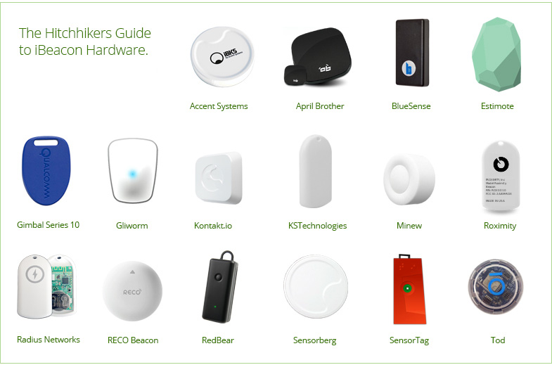
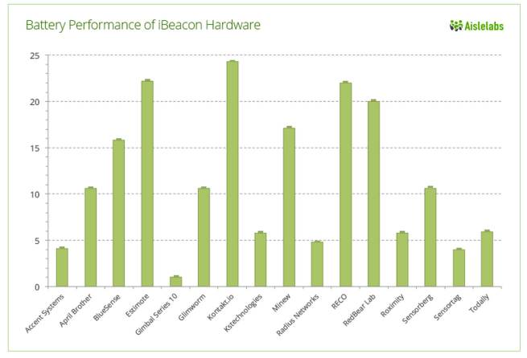
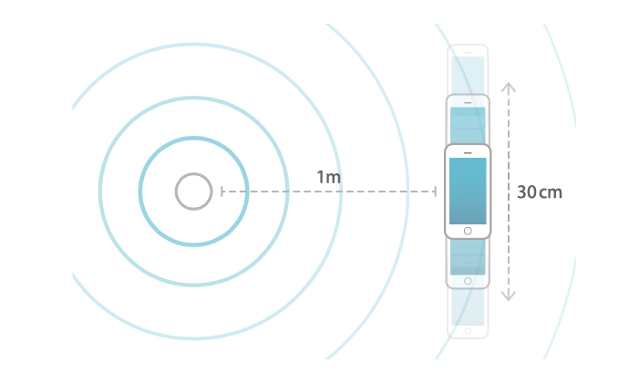
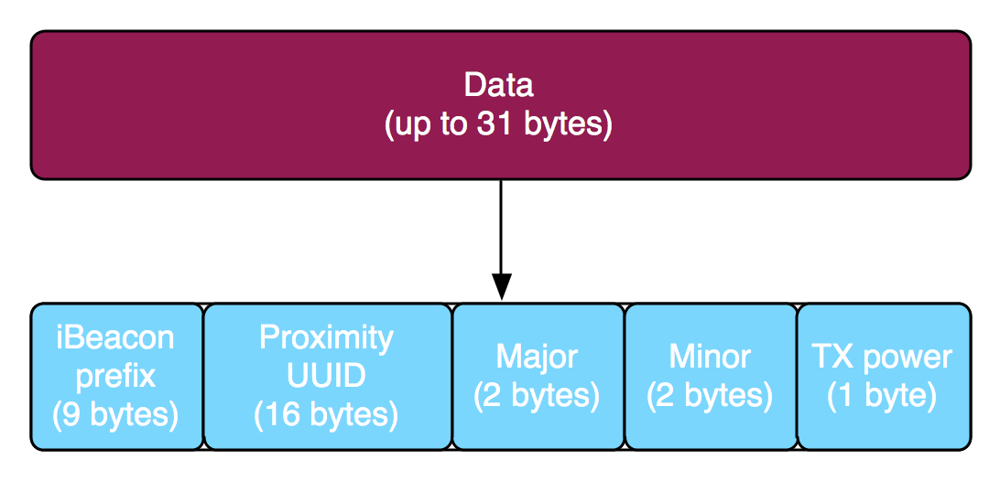
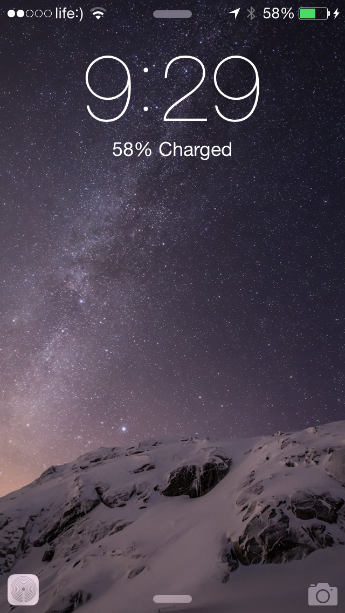

footer: 

## **Indoor navigation using** iBeacons

---

## Compatible devices

- iOS devices with Bluetooth 4.0 (iPhone 4S and later, iPad (3rd generation) and later, iPad Mini (1st generation) and later, iPod Touch (5th generation).
- Macintosh computers with OS X Mavericks (10.9) and Bluetooth 4.0

---

## iBeacon Hardware companies



---

## Battery Life of iBeacons



---

## Conclusions

[http://www.aislelabs.com/reports/beacon-guide/](http://www.aislelabs.com/reports/beacon-guide/)
<br>
 - Most Stylish beacon is: **Estimote**
 - High Performance beacon is: **Kontakt**
 - Value for Money beacon is: **Minew**
 - Beacon with Built-in Spoof Protection is: **Gimbal**

---



## Calibrating iBeacon

- Move the device slowly back and forth on a 30cm line, maintaining orientation, and 1m remaining equidistant from the measuring device (see diagram)

- Gather the values reported in the CLBeacon’s rssi property.
- Average the collected rssi values.
- Apply this Measured Power value to the beacon.

---

## iBeacon vs NFC

- NFC range is up to 20 cm (7.87 inches) but the optimal range is < 4 cm (1.57 inches). iBeacons have a significantly larger range.
- NFC can be either passive or active. When using passive mode, the power is sent from the reader device.
- Most smartphones ship with both Bluetooth 4.0 LE and NFC support.

---

## Bluetooth LE iBeacon packet

[http://stackoverflow.com/questions/18906988/what-is-the-ibeacon-bluetooth-profile](http://stackoverflow.com/questions/18906988/what-is-the-ibeacon-bluetooth-profile)



---

## BLE advertisement

```bash
02 01 06 1A FF 4C 00 02 15: iBeacon prefix (fixed)
```
```bash
B9 40 7F 30 F5 F8 46 6E AF F9 25 55 6B 57 FE 6D
```
proximity UUID (here: Estimote’s fixed UUID)

```bash
00 49: major
```
```bash
00 0A: minor
```
```bash
C5: 2’s complement of measured TX power
```

---


## iBeacon Security | Spoofing

```bash
hcitool -i hci0 lescan—passive
D6:EE:D4:16:ED:FC (unknown)
F6:BE:90:32:3C:5E (unknown)
...
```

```bash
hcidump -R -i hci0
> 04 3E 2A 02 01 00 01 FC ED 16 D4 EE D6 1E 02 01 06 1A FF 4C
  00 02 15 B9 40 7F 30 F5 F8 46 6E AF F9 25 55 6B 57 FE 6D ED
  FC D4 16 B6 B4
...
```

---

## CoreLocation && CoreBluetooth

```objc 
import CoreLocation
import CoreBluetooth
```

```swift
// CLBeacon
// CLBeaconRegion
// CLLocationManager
// CBCentralManager
```

--- 

## [CLBeaconRegion] init

```swift
init(proximityUUID proximityUUID: NSUUID!, 
           identifier identifier: String!)
```

```swift
init(proximityUUID proximityUUID: NSUUID!, 
                     major major: CLBeaconMajorValue, 
           identifier identifier: String!)
```

```swift
init(proximityUUID proximityUUID: NSUUID!, 
                     major major: CLBeaconMajorValue, 
                     minor minor: CLBeaconMinorValue, 
           identifier identifier: String!)
```

---

## CLBeaconRegion params

```swift
var notifyOnEntry: Bool // By default is true
var notifyOnExit: Bool // By default is true
var notifyEntryStateOnDisplay: Bool // By default is false.
```

**Discussion**
 - When set to true, the location manager sends beacon notifications when the user turns on the display and the device is already inside the region. 
 - Calls **locationManager:didDetermineState:forRegion:**

---

## CLBeacon

Identifying the Beacon

```swift
var proximityUUID: NSUUID! { get }
var major: NSNumber! { get }
var minor: NSNumber! { get }
```
Determining the Beacon Distance

```swift
var accuracy: CLLocationAccuracy { get }
var rssi: Int { get }
var proximity: CLProximity { get }

enum CLProximity : Int {
    case Unknown
    case Immediate
    case Near
    case Far
}
```

^ accuracy: Indicates the one sigma horizontal accuracy in meters. Use this property to differentiate between beacons with the same proximity value. Do not use it to identify a precise location for the beacon.

---

## What to check before start?

**CLLocationManager**

```swift
func requestAlwaysAuthorization()
class func locationServicesEnabled() -> Bool
```

**CBCentralManager**

```swift
var state: CBCentralManagerState { get }
enum CBCentralManagerState : Int {
    case Unknown
    case Resetting
    case Unsupported
    case Unauthorized
    case PoweredOff
    case PoweredOn
}
```

---

## Requesting Multiple Permissions

```swift
switch CLLocationManager.authorizationStatus() {
    case .Authorized:
        // ...
    case .NotDetermined:
        manager.requestAlwaysAuthorization()
    case .AuthorizedWhenInUse, .Restricted, .Denied:
        let alertController = UIAlertController(
            title: "Background Location Access Disabled",
            message: "In order to be notified about excibitions near you, please open this app's settings and set location access to 'Always'.",
            preferredStyle: .Alert)

        let cancelAction = UIAlertAction(title: "Cancel", style: .Cancel, handler: nil)
        alertController.addAction(cancelAction)

        let openAction = UIAlertAction(title: "Open Settings", style: .Default) { (action) in
            if let url = NSURL(string:UIApplicationOpenSettingsURLString) {
                UIApplication.sharedApplication().openURL(url)
            }
        }
        alertController.addAction(openAction)

        self.presentViewController(alertController, animated: true, completion: nil)
}
```

---

##iOS 8 support

```swift
//describes the reason why the app accesses the user’s location information
```

**NSLocationAlwaysUsageDescription**

<br>

This key is required when you use the **requestAlwaysAuthorization** method of the **CLLocationManager** class to request authorization for location services.


---

## CLLocationManager

Monitoring

```swift
func startMonitoringForRegion(_ region: CLRegion!)
func stopMonitoringForRegion(_ region: CLRegion!)
func requestStateForRegion(_ region: CLRegion!)
@NSCopying var monitoredRegions: NSSet! { get }
```

Ranging

```swift
func startRangingBeaconsInRegion(_ region: CLBeaconRegion!)
func stopRangingBeaconsInRegion(_ region: CLBeaconRegion!)
@NSCopying var rangedRegions: NSSet! { get }
```

---

### CLLocationManager | Responding to Region Events

```swift
optional func locationManager(_ manager: CLLocationManager!, 
                  didEnterRegion region: CLRegion!)

optional func locationManager(_ manager: CLLocationManager!, 
                   didExitRegion region: CLRegion!)

optional func locationManager(_ manager: CLLocationManager!, 
     didStartMonitoringForRegion region: CLRegion!)
```

```swift
optional func locationManager(_ manager: CLLocationManager!, 
                didDetermineState state: CLRegionState, 
                       forRegion region: CLRegion!)

enum CLRegionState : Int {
    case Unknown
    case Inside
    case Outside
}
```

---

### CLLocationManager | Responding to Ranging Events


```swift
optional func locationManager(_ manager: CLLocationManager!, 
                didRangeBeacons beacons: [AnyObject]!, 
                        inRegion region: CLBeaconRegion!)

optional func locationManager(_ manager: CLLocationManager!, 
  rangingBeaconsDidFailForRegion region: CLBeaconRegion!, 
                        withError error: NSError!)
```

---

## Passbook Integration

**major** Major identifier of a Bluetooth Low Energy location beacon.
**minor** Minor identifier of a Bluetooth Low Energy location beacon.
**proximityUUID** Unique identifier of a Bluetooth Low Energy location beacon.
**relevantText** Text displayed on the lock screen when the pass is currently relevant. “Store nearby on 1st and Main.”

---



## Suggested Apps are now powered by iBeacon

iOS 8 Suggested Apps was solely powered by GPS geofences - similar to how the “Popular Near Me”, however, can now also be triggered by iBeacon.

Beacon-triggered Apps work slightly differently than GPS-triggered ones. The app does need to be installed on your device. 

---

## Limits

- Regions are a shared system resource, and the total number of regions available systemwide is limited. For this reason, Core Location limits to 20 per app.
- In the background, you only have around 5 seconds of ranging time, which does not give you as much time to average RSSI

---

## Background

```swift
optional func locationManager(_ manager: CLLocationManager!, 
                  didEnterRegion region: CLRegion!)
```

```swift
UIApplication.sharedApplication().beginBackgroundTaskWithExpirationHandler({})
UIApplication.sharedApplication().endBackgroundTask(taskID)
```

**Extending Background ranging**
[http://developer.radiusnetworks.com/2014/11/13/extending-background-ranging-on-ios.html](http://developer.radiusnetworks.com/2014/11/13/extending-background-ranging-on-ios.html)

---


## Questions?

**Fedya Skitsko**, 
Lead iOS Developer

<br>

**Demo project**
[https://github.com/XBeg9/iBeaconDemo](https://github.com/XBeg9/iBeaconDemo)

<br>

[fedya@skitsko.com](mailto:fedya@skitsko.com)
[https://twitter.com/XBeg9](https://twitter.com/XBeg9)
[https://github.com/XBeg9](https://github.com/XBeg9)

